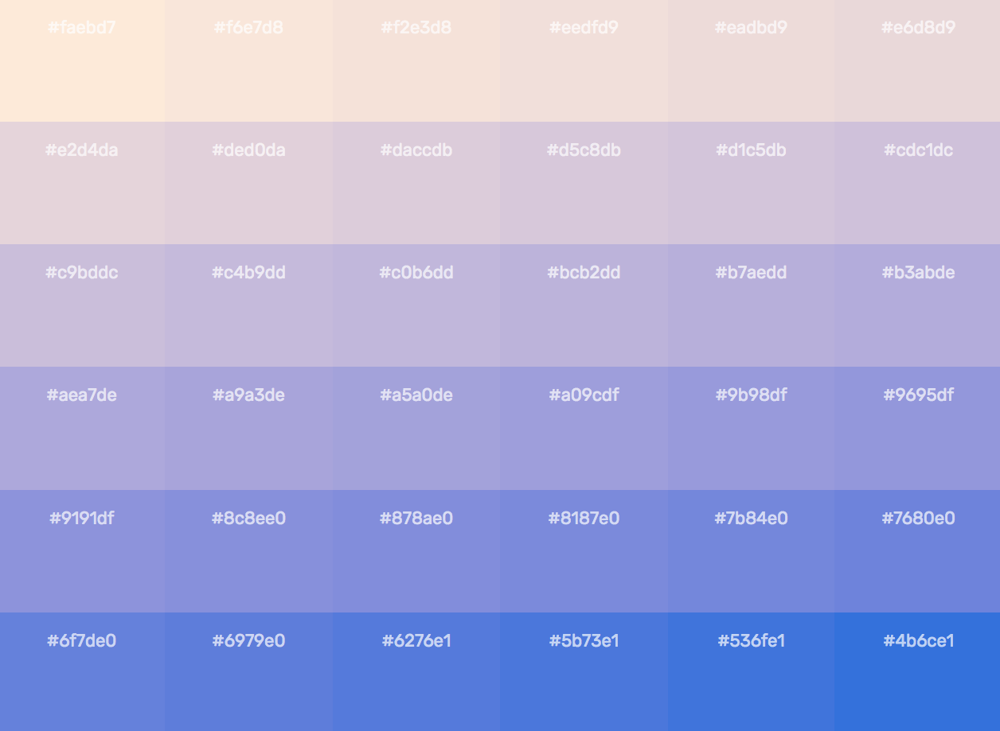

# Color Time

A quick way to create color gradients between two colors in the [Lab color space](https://en.wikipedia.org/wiki/Lab_color_space). Select the two colors from a dropdown of [HTML color names](https://www.w3schools.com/colors/colors_names.asp) and the number of cells on one side of a grid. The gradient uses [chroma.js color.scale method](https://gka.github.io/chroma.js/#color-scales) to convert a matrix of values to colors.

## Example

Visit this page to give it try: [https://boydx.github.io/color-time](https://boydx.github.io/color-time)

## To do

* Create new matrices for mixing colors. Current matrix is a linear conversion.
* Add export of color values by selecting div elements

## JS libraries used

chroma.js - [https://github.com/gka/chroma.js/](https://github.com/gka/chroma.js/)
jQuery - DOM utility
